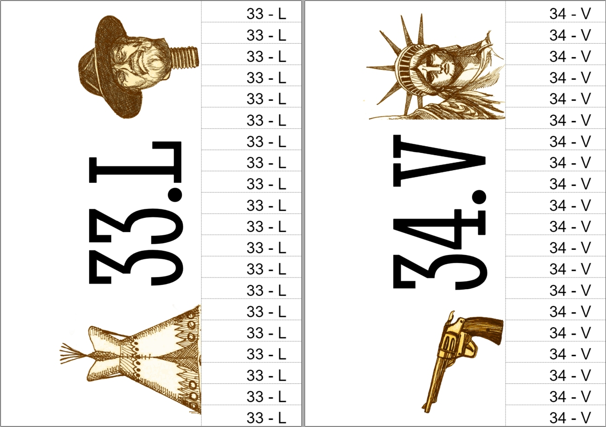

# PumaFromSierra
Prepare print for children outdoor game.
This utility asks you for a riddle, which is then capitalized and for each letter one page is rendered. Just use the browser print.

These pages are then tied to trees or other things and children in teams are trying to find all letters from the riddle and find the answer.
There are 20 (as default) tornable leaves for little children who are not able to read yet.

Pumas are other adults or children marked as dangerous Pumas, who are able to touch the child which forces him to go HOME to get another life, or something.
Variants are simple to find.

